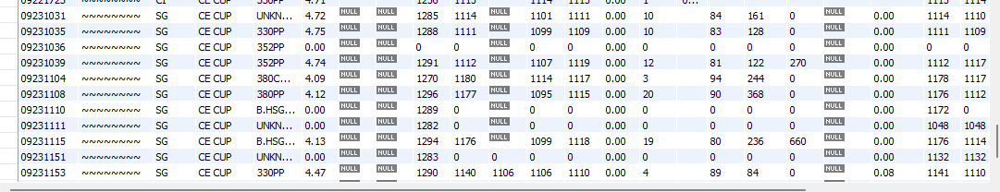

# IOT-Logger -- Edge-to-MySQL Real-Time Data Logging
I built an **IoT Logger** that collects real-time data from sensors and industrial machines, processes it locally on an **edge gateway**, and stores it in a **MySQL database** for analysis.
The idea was to make a **reliable**, **lightweight system** that works even if the network goes down and can run on a **Windows/linux-based gateway**.

The gateway connects to sensors or controllers using **Ethernet or Wi-Fi**, receives data, and sends it to a local MySQL database through an **ODBC (Open Database Connectivity)** link. This helps keep the system **modular and platform-independent**.
For database design and testing, I used **MySQL Workbench** to create tables, manage queries, and verify data flow.

The system has **local buffering**, so if the network connection fails, data is still stored on the gateway until it can sync again. Once connected, all records are automatically updated in the main database. This makes it reliable for **24/7 data collection** in environments where uptime is critical.

# Step 1 : List of Components Required
## Hardware Components
- **IoT Gateway** – A Windows or Linux-based edge device (such as an industrial PC, Intel NUC, or Raspberry Pi) that directly interfaces with connected sensors.
Handles all data acquisition, local buffering, and communication with the database.

- **Sensors / Field Inputs** – Temperature, pressure, or vibration sensors depending on the application.
Provide real-time process or environmental data directly to the gateway.

- **Network Interface** – Ethernet or Wi-Fi for data transmission between the gateway and the MySQL server.

## Software Components
- **MySQL Server** – Core database used for structured data storage and retrieval.

- **MySQL Workbench** – Used for database schema design, data querying, and real-time monitoring.

- **ODBC Connector (DSN-based)** – Provides standardized connectivity between the edge application and MySQL.

- **Operating System** – Windows 10/11 or Linux, depending on the gateway hardware.

- **Custom Edge Application** – Developed in-house; manages sensor communication, data validation, and automated database logging.

# How It Works
The IoT Logger is built around an edge gateway that connects directly to sensors or industrial machines and sends data to a MySQL database in real time.
It combines hardware-level data acquisition with software-based processing and logging.

Here’s how the system operates step by step 👇

**1. Data Acquisition: **
The IoT Gateway reads continuous data from connected sensors or controllers through GPIO, USB, or RS485 (Modbus).
These inputs represent real-world variables like temperature, pressure, or vibration.

**2. Data Processing: **
Each data point is processed locally by:
 * Converting raw sensor values into engineering units.
 * Attaching timestamps and record IDs.
 * Validating readings and filtering unstable values.
 * Temporarily storing records to prevent data loss during network outages.

**3. Database Logging: **
The gateway connects to a MySQL database via an **ODBC DSN**.
It automatically inserts formatted entries into predefined tables (e.g., results or measurements).
This DSN-based design decouples the code from specific database configurations, making deployment simple and portable.

**4. Data Storage & Access: **
All logged data is securely stored in MySQL — locally or remotely.
Using **MySQL Workbench**, users can visualize, filter, and export data in CSV or spreadsheet formats for further analysis.

**5. Reliability & Recovery: **
If the network connection is lost, the gateway automatically switches to offline buffering.
When the connection is restored, all pending records are synced seamlessly to the main database — ensuring **zero data loss**.

# Key features
**Device integration:** captures live telemetry from sensors/controllers over Ethernet or Wi-Fi.
**Local buffering:** gateway stores data locally to tolerate intermittent connectivity.
**Structured storage:** records saved in MySQL for long-term analysis and export (CSV).
**Extensible:** integrates later with dashboards, APIs, or analytics engines.
**Portable:** works on a Windows gateway, Raspberry Pi, or a personal laptop.

# High-Level Architecture
**Sensors → IoT Gateway → ODBC DSN → MySQL Database → Analytics / Export**
 * The gateway collects sensor data via Ethernet, Wi-Fi, or serial interfaces.
 * Data is validated, timestamped, and stored locally.
 * Through ODBC, the gateway performs inserts and updates to the MySQL database.

# Database Schema
The MySQL database (example: meter) includes structured tables for storing measurement records.
Each entry typically contains fields like timestamp, sensor ID, measured value, and status flag.

# Data Access and Processing
The gateway application automates interaction with MySQL using ODBC connectivity.
It performs all **CRUD** operations programmatically — reading, inserting, and updating measurement data without manual input.

# Functionality Summary
 * Establishes a secure ODBC connection to MySQL.
 * Fetches the table 'results'.
 * Inserts a new record dynamically by iterating through field indices.
 * Provides feedback upon successful data insertion.
 
# Implementation Notes
**MySQL Setup** – Install MySQL locally or on the gateway, create schemas and tables via MySQL Workbench.
**ODBC Configuration** – Create a DSN with MySQL Connector/ODBC, specifying host, port, and credentials.
**Application Logic** – Read sensor inputs, format data, and perform parameterized inserts via DSN.
**Offline Mode** – In case of disconnection, buffer records locally and auto-sync when network restores.
**Testing Environment** – Can be replicated entirely on a laptop using a local MySQL instance.

# Use Cases
- Industrial machine telemetry  
- IoT sensor data collection  
- Smart factory monitoring  
- Research data logging  

# Outcome
The system successfully logged and visualized **temperature data** in real time.
The use of **MySQL + ODBC** created a reliable data-handling pipeline.
This setup proved suitable for **small-to-medium industrial setups** where **edge computing and local storage** are essential.

This method demonstrates a direct way to perform data logging, monitoring, and automation control in an IoT-enabled environment using simple, lightweight software tools.
